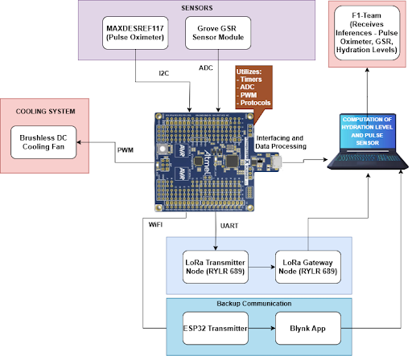
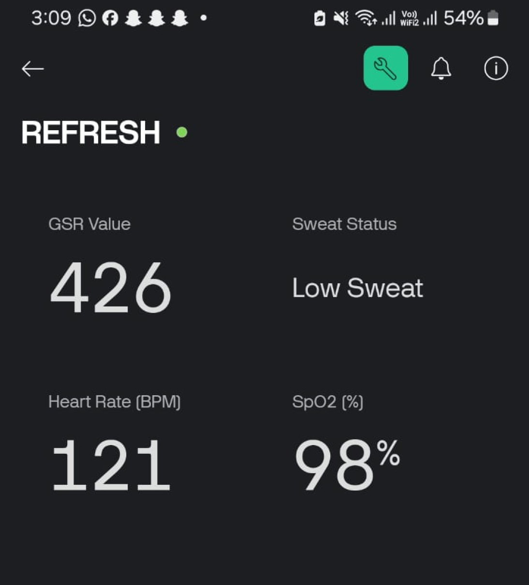
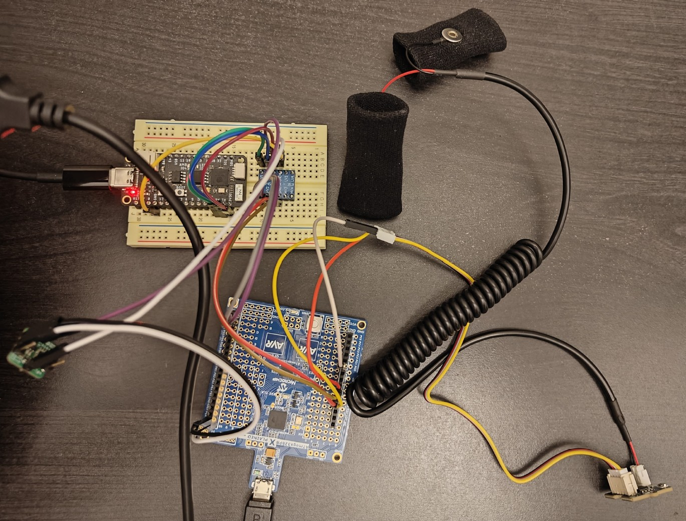
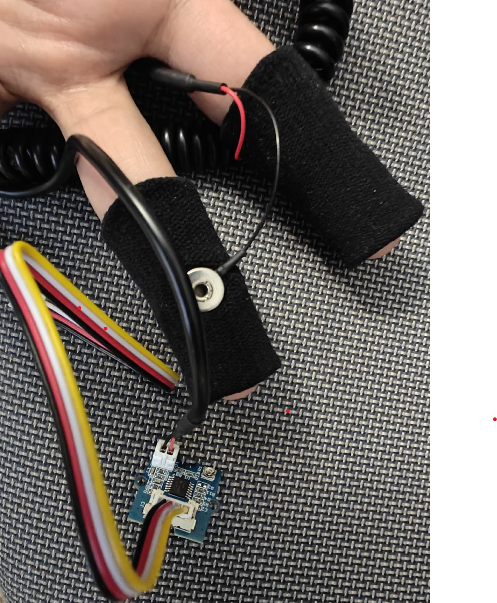
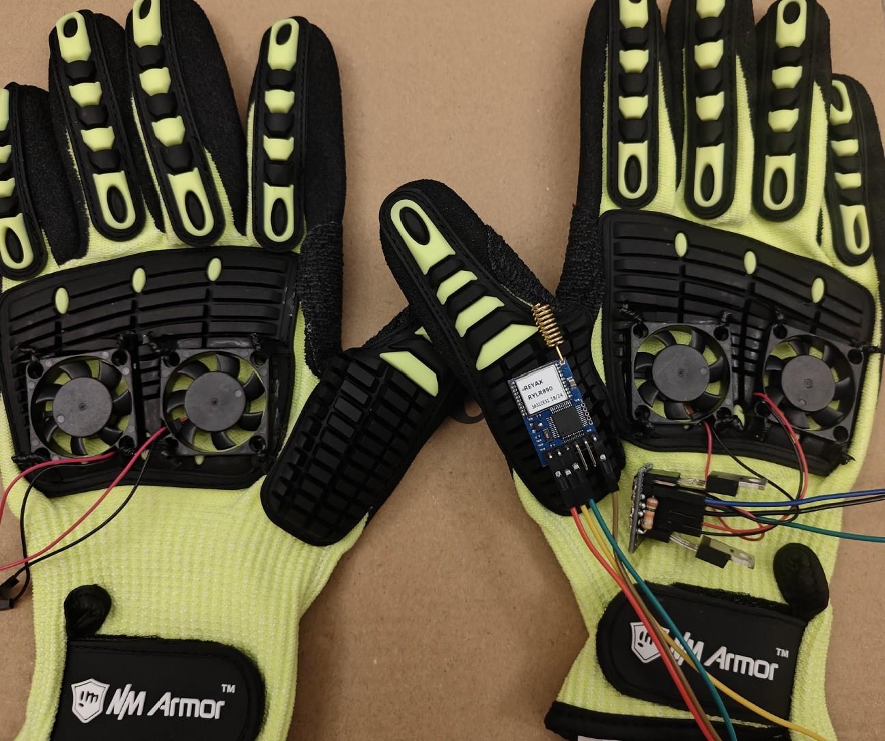
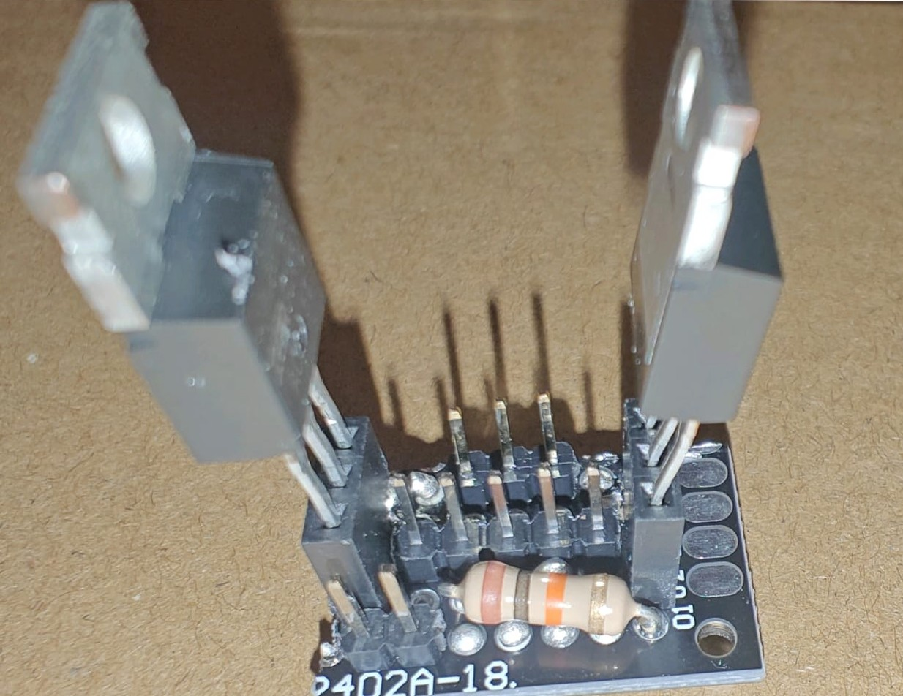
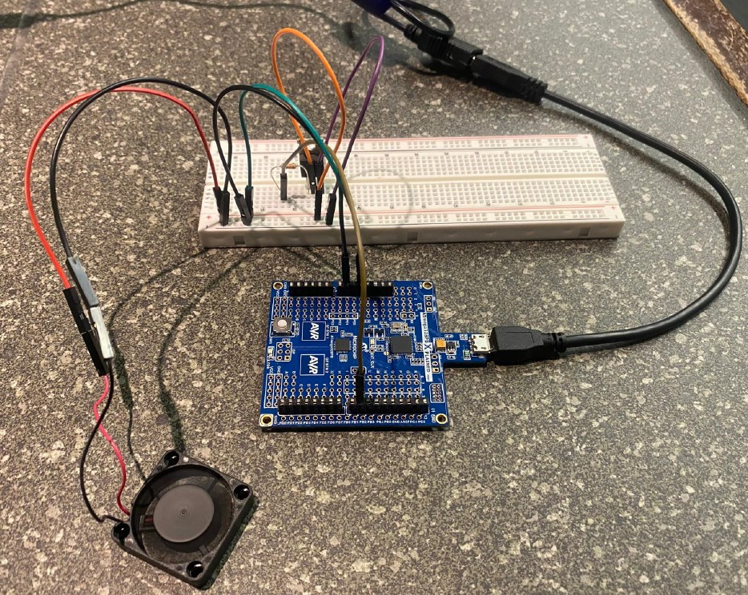

## **Home**

## **Welcome to R.E.F.R.E.S.H**

### **Revolutionizing Formula 1 Driver Safety and Performance**

#### 
R.E.F.R.E.S.H (Racing Equipment for Fluid Regulation and Enhanced Sweat Handling) is an innovative wearable glove system designed to improve the safety and efficiency of Formula 1 drivers. By integrating advanced sensor technology, real-time health monitoring, and efficient cooling mechanisms, this project addresses the unique challenges of high-performance racing.

## **About the Project**

### **Background**

#### 
Formula 1 drivers endure extreme physical and environmental stress during races, often experiencing dehydration, overheating, and cognitive fatigue. These conditions compromise their performance and safety.
R.E.F.R.E.S.H tackles these challenges with:
- Real-time monitoring of hydration, pulse, and SpO₂ levels.
- Dynamic cooling systems for temperature regulation.
- Reliable data transmission using LoRa technology for remote health management.

### **Our Goal**

####
Our project has the following objectives:

- Hydration Monitoring: Provide real-time feedback on hydration levels using GSR data, processed through a machine learning model.
- Vital Sign Tracking: Monitor heart rate and oxygen saturation with precision.
- Dynamic Cooling: Automatically adjust cooling intensity based on hydration levels.
- Reliable Communication: Ensure seamless data transmission using LoRa and a backup ESP32 system.

## **Design**

### **Hardware Requirements Specification (HRS)**

#### 
The hardware requirements focus on modularity, precision, and performance. Key specifications include:
- Microcontroller: ***ATmega328PB*** for sensor integration and control logic.
- Sensors:
    - ***MAX30102 Pulse Oximeter*** for SpO₂ and heart rate.
    - Grove ***GSR Sensor*** for hydration monitoring.
- Cooling System: PWM-controlled ***DC fan*** for temperature regulation.

### **HRS Results**

####
- The ATmega328PB successfully integrated with all sensors.
- The PWM-controlled fan system was tested at different hydration states, demonstrating seamless speed adjustments.

### **Software Requirements Specification (SRS)**

####
The software design supports data acquisition, real-time processing, and machine learning integration. Key specifications include:
- Sensor Data Acquisition:
    - ***I2C*** for pulse oximeter data.
    - ***ADC*** for GSR sensor readings.
- Control Logic:
    - A ***Random Tree Classifier*** classifies hydration levels ("Hydrated," "Medium Hydration," "Dehydrated") based on GSR data.
    - Fan speed dynamically adjusts using ***Timer1*** in ***Fast PWM mode***.
- Communication Module:
    - ***ESP32*** transmits data to the ***Blynk*** app for real-time monitoring.

### **SRS Results**

####
- GSR data updated hydration levels every second.
- The ML model achieved 98% accuracy in classifying hydration levels.
- Data transmission via ESP32 was reliable, with all sensor data visualized on the Blynk platform in real-time.

### **Flow Diagram**
####

The F1 Cooling Glove is a sophisticated system comprising a custom processing board, sensors, a cooling mechanism, and communication modules. Each component works in unison to monitor the driver’s physiological state and regulate cooling based on real-time data. Below is a detailed summary of the block diagram’s functionality:

**Core Processing Board**
- The custom processing board, built around the ATmega328PB microcontroller, serves as the central hub for integrating and coordinating the system’s components.
- It handles data acquisition, processing, and communication using built-in peripherals like timers, ADC (Analog-to-Digital Converter), PWM (Pulse Width Modulation), and I2C communication protocols.
- The processing board supports:
    - I2C communication to interface with digital sensors.
    - ADC inputs to handle analog signals, such as those from the GSR sensor.
    - PWM outputs to control the fan speed dynamically based on hydration levels.

**Key Sensors**
1. MAXREFDES117 Pulse Oximeter:
    - Embedded within the glove to monitor the driver’s blood oxygen saturation (SpO₂) and heart rate in real time.
    - Connects to the processing board via I2C for efficient and accurate data transfer.
2. Grove GSR Sensor Module:
    - Measures the driver’s galvanic skin response (GSR), which provides insights into hydration and stress levels.
    - Outputs analog signals processed by the microcontroller’s ADC to classify hydration levels using thresholds or machine learning algorithms.

**Cooling Mechanism**
- A brushless DC cooling fan ensures the driver’s hand remains cool during intense racing conditions.
- The initial prototype's fan is controlled via a MOSFET switching system, enabling precise speed modulation based on real-time GSR data.
- The final prototype used a 3-pin connector fan where it's PWM pin was controlled by signals generated by the ATmega328PB and the fan speed was adjusted dynamically to maintain comfort while reducing unnecessary power consumption.

**Data Transmission**
1. Primary Communication (ESP32 and Blynk):
    - An ESP32 module serves as the primary communication interface, transmitting biometric and hydration data to the Blynk app.
    - The Blynk platform allows real-time visualization of the driver’s physiological metrics, such as SpO₂, heart rate, and hydration levels, ensuring that the F1 team can monitor the driver's state continuously.

2. Secondary Communication (LoRa):
    - A backup communication system using LoRa modules provides long-range data transmission for redundancy.
    - Ensures uninterrupted monitoring in case of Wi-Fi connectivity issues.

**Machine Learning Integration**
- The GSR data is processed using a machine learning model embedded in the processing board.
- A Random Tree Classifier categorizes hydration levels into:
    - Hydrated
    - Medium Hydration
    - Dehydrated
The hydration classification guides fan speed adjustments and provides real-time feedback to the F1 team.

**System Workflow**
- Sensors collect physiological data (SpO₂, heart rate, and GSR).
- The processing board aggregates and analyzes data, applying machine learning models for hydration classification.
- Based on hydration levels, PWM signals adjust fan speeds dynamically.
- Processed data is transmitted via ESP32 to the Blynk app and through LoRa for redundancy.
- The Blynk app provides real-time visualization of the driver’s physiological state.

## **Testing and Challenges**

####
- **Thermal Management**: The initial MOSFET-based fan design caused overheating, resolved by transitioning to direct PWM-controlled fans.
- **Sensor Calibration**: GSR sensor inaccuracies were addressed through extensive calibration, ensuring reliable hydration monitoring.
- **Communication Issues**: LoRa reliability concerns were mitigated by switching to ESP32, which enhanced data consistency and integration with Blynk.

## **Results**

####
- The final glove design effectively integrated all components, achieving its objectives of physiological monitoring and cooling.
- The fan system dynamically adjusted speeds based on hydration states, ensuring optimal performance.
- Data transmission via ESP32 was reliable, with all sensor data visualized on the Blynk platform in real-time.
- Machine learning accurately classified hydration levels, with a 98% success rate on test data.

## **Conclusion**

####
The REFRESH glove showcases a breakthrough in wearable technology for high-performance athletes. It combines precision monitoring, intelligent cooling, and robust communication, providing a holistic solution for Formula 1 drivers.

What We Would Do Differently:
- **Further Miniaturization**: Optimize hardware layout for a more compact and lightweight design.
- **Additional Sensors**: Integrate core body temperature and stress sensors for a more comprehensive physiological profile.
- **Advanced Data Analysis**: Implement cloud-based storage and analytics for long-term performance tracking.
- **Enhanced Communication**: Use BLE or 5G to improve scalability and reduce latency.

This system has potential applications in high-stress environments such as firefighting, military operations, and industrial safety, marking a significant step forward in wearable technology.

## **Media**

### **Video**

####
Embed a demo video showcasing the glove’s features and functionality.

### **Gallery**

####

## **Team**

### **Meet the Creators**

####
1. Chirag Satapathy
2. Sanskriti Binani
3. Megha Mistry

## **Acknowledgments**

####
We extend our gratitude to the University of Pennsylvania's ESE 5190 faculty and mentors for their guidance and support.
